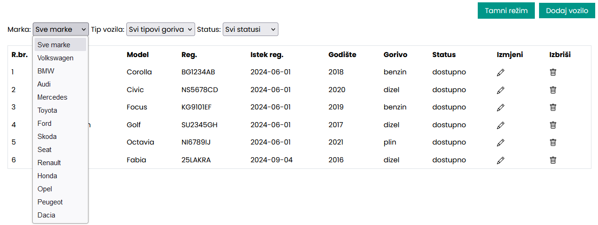
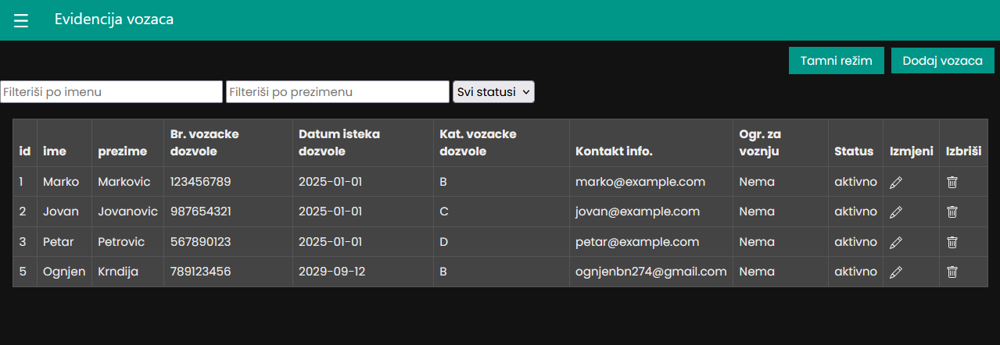
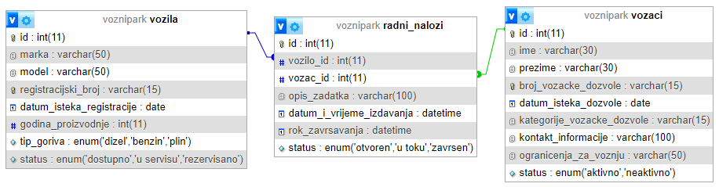

# PIS_Voznipark
 
# Vozni park

## UVOD 

U okviru ovog seminarskog rada obrađena je tema upravljanja voznim parkom kroz izradu web aplikacije koristeći savremene tehnologije za frontend i backend razvoj. Aplikacija je razvijena koristeći **HTML**, **CSS** i **JavaScript** za frontend, čime je omogućena intuitivna i interaktivna korisnička interakcija. Korišten je **Bootstrap** framework za brže i responzivnije oblikovanje korisničkog interfejsa.
Sa serverske strane, za izgradnju backend dijela aplikacije korišćen je **FastAPI** framework, poznat po jednostavnosti implementacije i brzini, koji podržava osnovne CRUD (Create, Read, Update, Delete) operacije za upravljanje podacima. U radu sa podacima, korišćen je **MySQL** kao baza podataka, što je omogućilo efikasno skladištenje, upravljanje i pretragu podataka o voznom parku.
Cilj ovog projekta bio je da se kroz integraciju različitih tehnologija napravi funkcionalna aplikacija koja će omogućiti jednostavno praćenje i upravljanje vozilima u voznom parku, uz intuitivan korisnički interfejs i stabilnu backend podršku.

## STRUKTURA PODATAKA 

Projekat “Vozni park” organizovan je u nizu fajlova i direktorijuma koji zajedno čine funkcionalnu cjelinu za upravljanje evidencijom vozila, vozača i radnih naloga. Svaki fajl ima specifičnu ulogu u projektu: <br>
•	app: Ovaj direktorijum sadrži backend aplikaciju razvijenu koristeći FastAPI framework u Python-u. Sadrži API rute, modele podataka i logiku aplikacije. <br>
•	web: Direktorijum koji sadrži sve fajlove za frontend implementaciju. Ovde se nalaze HTML, CSS i JavaScript fajlovi koji omogućavaju korisnicima interakciju sa backend-om putem web interfejsa.<br>
•	README: Dokumentacija projekta koja pruža osnovne informacije o projektu.. <br>
•	requirements: Fajl koji sadrži listu Python biblioteka potrebnih za izvršavanje aplikacije. Ovo uključuje FastAPI, uvicorn, pydantic i druge zavisnosti. <br>
•	sample_data.py: Python skripta koja služi za unošenje podataka u MySQL bazu. Ova skripta pomaže u testiranju aplikacije sa realnim podacima. <br>
•	create_usersql: Skripta za kreiranje korisnika u MySQL bazi podataka. Automatizuje proces kreiranja korisničkih naloga u sistemu. <br>
•	Docker folderi: Direktorijumi koji sadrže Dockerfile i docker-compose.yml fajlove za konfigurisanje Docker kontejnera. Ovo omogućava laku reprodukciju aplikacije u Docker okruženju. <br>
•	.env: Konfiguracioni fajl za virtualno okruženje, koji sadrži važne konfiguracije kao što su putanja do baze podataka i druge podesive parametre.
Ova struktura omogućava jasnu organizaciju i održavanje projekta “Vozni park”, omogućavajući developerima efikasno razvijanje, testiranje i implementaciju novih funkcionalnosti

## BACKEND

Za backend aplikacije korišćen je FastAPI framework, koji je relativno novi Python web framework, poznat po svojoj jednostavnosti, brzini i podršci za asinhrone operacije. FastAPI je posebno pogodan za razvoj aplikacija koje moraju brzo obrađivati zahteve i omogućava laganu integraciju sa standardnim Python bibliotekama, što ga čini idealnim izborom za našu aplikaciju za upravljanje voznim parkom. FastAPI je odabran zbog podrške za brze i efikasne CRUD operacije (kreiranje, čitanje, ažuriranje i brisanje podataka) koje su bile ključne za upravljanje podacima o vozilima. Implementacija CRUD operacija omogućila je kreiranje novih zapisa (npr. unosa novih vozila), prikaz postojećih zapisa, kao i ažuriranje i brisanje podataka o vozilima u voznom parku.<br>
Backend aplikacija koristi **SQLAlchemy ORM** (Object Relational Mapper) za rad sa MySQL bazom podataka. SQLAlchemy omogućava efikasno mapiranje Python klasa na tabele u MySQL-u, čime se pojednostavljuje rad sa bazom podataka kroz objektno-orijentisani pristup.<br> <br>
FastAPI koristi **Pydantic** za validaciju ulaznih podataka, što osigurava da podaci koji stižu od korisnika budu ispravni pre nego što se sačuvaju u bazu podataka. Na primer, kada korisnik unese podatke o novom vozilu, Pydantic validira da li su uneti svi potrebni podaci i da li su u ispravnom formatu. <br>
Backend se sastoji od nekoliko ključnih komponenti: <br>
•	API rute <br>
•	Modeli podataka <br>
•	Šeme <br>
•	DB fajl <br>
•	Main fajl <br>

**API RUTE**  u ovom projektu su definisane tako što se prvo kreira API router (APIRouter()) kako bi se grupisale rute. Zatim se za svaku rutu definiše dekorator (npr. @router.post("/")). Unutar funkcije za rutu, specificira se šta ruta radi i povezuje se sa bazom koristeći **db: Session = Depends(get_db).** Nakon toga se šalju zahtjevi bazi podataka i dobijaju odgovori. Na kraju, funkcija vraća podatke kao odgovor na zahtev, omogućavajući organizovano i efikasno upravljanje rutama i operacijama nad podacima u bazi. <br>

**Modeli** podataka reprezentuju strukturu podataka koji se koriste u aplikaciji. Na primjer, model za vozača predstavlja klasu koja definiše strukturu tabele “vozaci” u bazi podataka. Ispod tabele definisan je odnos sa modelom “RadniNalog” koji omogućava navigaciju između vozača i njegovih radnih naloga. Varijabla back_populates='vozac' omogućava obostranu vezu između dva modela. <br>


```python
class Vozac(Base):
    __tablename__ = 'vozaci'

    id = Column(Integer, primary_key=True, index=True)
    ime = Column(String(30), index=True)
    prezime = Column(String(30), index=True)
    broj_vozacke_dozvole = Column(String(15), unique=True)
    datum_isteka_dozvole = Column(Date)
    kategorije_vozacke_dozvole = Column(String(15))
    kontakt_informacije = Column(String(100))
    ogranicenja_za_voznju = Column(String(50))
    status = Column(Enum('aktivno', 'neaktivno', name='status_vozaca'), default='aktivno')

    radni_nalozi = relationship('RadniNalog', back_populates='vozac')
```
<br>

**ŠEME** za radne naloge definišu strukturu i validaciju podataka pomoću Pydantica. Klase se kreiraju kao naslednici BaseModel iz Pydantica i predstavljaju modele podataka sa atributima i validacionim pravilima. Enumeracija (StatusRadnogNalogaEnum) definiše tri moguća statusa radnog naloga: otvoren, u toku, i završen. Ovo osigurava da atribut statusa može imati samo dozvoljene vrijednosti. Bazična klasa (RadniNalogBase) sadrži osnovne atribute radnog naloga, uključujući ID vozila i vozača, opis zadatka, datum i vreme izdavanja, rok završavanja i status. Klasa za kreiranje (RadniNalogCreate) nasleđuje bazičnu klasu i koristi se za validaciju prilikom kreiranja novih radnih naloga. Klasa za izlazne podatke (RadniNalogOut) dodaje dodatni atribut id i koristi se za povratne podatke prema klijentu. Ova struktura omogućava striktno definisanje i validaciju podataka, čineći aplikaciju sigurnijom i pouzdanijom. <br>

```python
 class StatusRadnogNalogaEnum(str, Enum):
    otvoren = 'otvoren'
    u_toku = 'u toku'
    zavrsen = 'zavrsen'

class RadniNalogBase(BaseModel):
    vozilo_id: int
    vozac_id: int
    opis_zadatka: str
    datum_i_vrijeme_izdavanja: datetime
    rok_zavrsavanja: datetime
    status: StatusRadnogNalogaEnum

class RadniNalogCreate(RadniNalogBase):
    pass

class RadniNalogOut(RadniNalogBase):
    id: int
    
    class Config:
       from_attributes = True
```
<br>

**Db fajl** - Ovaj kod kreira SQLAlchemy konekciju sa MySQL bazom koristeći create_engine i URL konekcije (u ovom slučaju MySQL baza na lokalnom serveru). Kroz sessionmaker, omogućava se kreiranje sesija za rad sa bazom, sa isključenim automatskim commit-ovanjem i flush-ovanjem. Base = declarative_base() postavlja osnovnu klasu za definisanje modela (tabela), a funkcija get_db služi kao dependency za FastAPI, obezbeđujući sesiju sa bazom za svaki API poziv, koja se zatim pravilno zatvara nakon upotrebe.

*Sesija* 
<br>

```python
from sqlalchemy import create_engine
from sqlalchemy.orm import sessionmaker
from sqlalchemy.ext.declarative import declarative_base


DATABASE_URL="mysql+pymysql://root:@localhost/voznipark"

engine = create_engine(DATABASE_URL)
SessionLocal = sessionmaker(autocommit=False, autoflush=False, bind=engine)

Base = declarative_base()

# Dependency
def get_db():
    db = SessionLocal()
    try:
        yield db
    finally:
        db.close()
        db.close()
```
<br>

**Main fajl** definiše osnovnu konfiguraciju FastAPI aplikacije. Kreira se FastAPI instanca sa prilagođenim URL-ovima za dokumentaciju i dodaje se CORS middleware koji omogućava zahtjeve sa svih origin-a. Funkcija startup_event inicijalizuje bazu podataka pri pokretanju aplikacije pozivom init_db(). Definiše se jednostavna root ruta koja vraća "Hello, World", a sve definisane API rute uključene su pomoću app.include_router (api_router). <br>

```python
from fastapi import FastAPI
from db import init_db
from api.routes import api_router
from fastapi.middleware.cors import CORSMiddleware


app = FastAPI(docs_url="/api/docs/", openapi_url="/api/openapi.json")

origins = ["*"]

app.add_middleware(
    CORSMiddleware,
    allow_origins=origins,
    allow_credentials=True,
    allow_methods=["*"],
    allow_headers=["*"],
)


@app.on_event("startup")
def startup_event():
    init_db()  # Inicijalizujte bazu podataka kada aplikacija počne sa radom

@app.get("/api/")
def read_root():
    return {"Hello": "World"}


app.include_router(api_router)
```

## FRONTEND

Frontend aplikacija je ključna komponenta korisničkog interfejsa (UI) i odgovorna je za interakciju korisnika sa aplikacijom. U ovom projektu, frontend je razvijen koristeći HTML, CSS, JavaScript, a za brzo i responzivno oblikovanje korišćen je Bootstrap framework. Kroz kombinaciju ovih tehnologija omogućeno je kreiranje jednostavnog i intuitivnog interfejsa za rad sa voznim parkom. <br>

HTML (HyperText Markup Language): HTML je korišćen za definisanje strukture web stranice. Svaka stranica sadrži osnovne elemente poput zaglavlja, tabela, formi i dugmadi koje korisnici koriste za pregled podataka i interakciju sa sistemom. <br>

```HTML
<table class="table">
                <thead>
                    <tr>
                        <th scope="col">R.br.</th>
                        <th scope="col">Marka</th>
                        <th scope="col">Model</th>
                        <th scope="col">Reg.</th>
                        <th scope="col">Istek reg.</th>
                        <th scope="col">Godište</th>
                        <th scope="col">Gorivo</th>
                        <th scope="col">Status</th>
                        <th scope="col">Izmjeni</th>
                        <th scope="col">Izbriši</th>
                    </tr>
                </thead>
                <tbody id="tableBody">

                </tbody>
            </table>
```

Sledeće dvije slike prikazuju HTML koda za filterisanje vozila putem padajućeg menija i realan izgled tog koda
```HTML
<form id="filterFormVozila">
        <label for="filterBrand">Marka:</label>
        <select id="filterBrand" onchange="filterVehicles()">
                    <option value="all">Sve marke</option>
                    <option value="Volkswagen">Volkswagen</option>
                    <option value="BMW">BMW</option>
                    <option value="Audi">Audi</option>
                    <option value="Mercedes">Mercedes</option>
                    <option value="Toyota">Toyota</option>
                    <option value="Ford">Ford</option>
                    <option value="Skoda">Skoda</option>
                    <option value="Seat">Seat</option>
                    <option value="Reanult">Renault</option>
                    <option value="Honda">Honda</option>
                    <option value="Opel">Opel</option>
                    <option value="Peugeot">Peugeot</option>
                    <option value="Dacia">Dacia</option>
        </select>
```




**CSS** (Cascading Style Sheets): CSS je korišćen za stilizovanje HTML elemenata i kreiranje vizualno privlačnog i korisnički prijatnog interfejsa. Pomoću CSS-a definisane su boje, fontovi, raspored elemenata, kao i prilagođeni izgled različitih komponenata.

Takođe, implementirali smo opciju “Tamnog režima” gdje korisnik može izabrati opciju da li će interfejs biti prikazan u podrazumijevanoj bijeloj boji ili crnoj boji gdje manje zamara oči. U HTML smo dodali samo dugme za tamni režim, dok u CSS (kao I JavaScript-u) smo dodali kod za implementiranje tamnog režima. <br>
Sledeće dvije slike su prikaz css koda za tamni režim i realan prikaz tamnog režima.
```CSS
body.dark-mode {
    --background-color: #333;
    --text-color: #eee;
    --table-bg: #444;
    --table-border: #555;
}

body.dark-mode table {
    background-color: var(--table-bg);
    border-color: var(--table-border);
}

body.dark-mode th, body.dark-mode td {
    border-color: var(--table-border);
    background-color: var(--table-bg);
    color: var(--text-color);
}
```



U našoj aplikaciji, **JavaScript** fajlovi sadrže funkcije koje obavljaju osnovne CRUD operacije (kreiranje, čitanje, ažuriranje, brisanje) i omogućavaju otvaranje modala za dodavanje i izmjenu podataka. Ove funkcije su implementirane na sledeći način: <br>
**•	Fetch Podaci**: Svaka funkcija za komunikaciju sa backendom koristi fetch API kako bi slala i primala podatke sa servera. <br>
**•	Get:** Funkcija getVozila koristi fetch za dohvat podataka sa servera (GET metoda). Nakon uspješnog dobijanja podataka, tabela se popunjava podacima. <br>
**•	Insert**: Funkcija insertVozilo koristi fetch za slanje podataka na server (POST metoda). Podaci se šalju u JSON formatu, a prije slanja provjerava se da li su sva polja popunjena. <br>
**•	Update**: Funkcija updateVozilo koristi fetch za ažuriranje podataka na serveru (PUT metoda). Kao i kod unosa, podaci se šalju u JSON formatu i provjerava se da li su sva polja popunjena.<br>
**•	Delete**: Funkcija deleteVozilo koristi fetch za brisanje podataka sa servera (DELETE metoda). <br>
**•	Error Handling**: Svaka fetch operacija uključuje try-catch blokove kako bi se hvatale i prikazivale greške. Ako dođe do greške prilikom komunikacije sa serverom, prikazuje se odgovarajuća poruka. <br>
**•	Modali**: Funkcije openUpdateModal i clearInputFields koriste Bootstrap modal za prikaz i unos podataka. Funkcija openUpdateModal otvara modal i popunjava ga podacima odabranog entiteta, dok clearInputFields čisti input polja nakon zatvaranja modala. <br>
**•	Validacija**: Prije slanja podataka na server, provjerava se da li su sva obavezna polja popunjena. Ako neko polje nije popunjeno, baca se greška i prikazuje odgovarajuća poruka korisniku. Ovaj pristup osigurava da podaci budu pravilno poslani i primljeni sa servera, te da korisnici imaju intuitivno iskustvo prilikom korišćenja aplikacije.

JS kod za tamni režim i filterisanje.

```js
const toggleButton = document.getElementById('toggle-dark-mode');


if (localStorage.getItem('darkMode') === 'enabled') {
    document.body.classList.add('dark-mode');
}

// Funkcija za prebacivanje režima
toggleButton.addEventListener('click', () => {
    document.body.classList.toggle('dark-mode');

  
});

```
```js
function filterVehicles() {
    const brand = document.getElementById('filterBrand').value.toLowerCase();
    const fuelType = document.getElementById('filterFuelType').value;
    const status = document.getElementById('filterStatus').value;
    const rows = document.querySelectorAll('#tableBody tr');
    
    rows.forEach(row => {
        const rowBrand = row.querySelector('td:nth-child(2)').textContent.toLowerCase();  
        const rowFuelType = row.querySelector('td:nth-child(7)').textContent.toLowerCase();  // Tip goriva je 7. kolona
        const rowStatus = row.querySelector('td:nth-child(8)').textContent.toLowerCase();  // Status je 8. kolona
        
        const brandMatch = (brand === 'all' || rowBrand === brand);
        const fuelTypeMatch = (fuelType === 'all' || rowFuelType === fuelType);
        const statusMatch = (status === 'all' || rowStatus === status);
        
        if (brandMatch && fuelTypeMatch && statusMatch) {
            row.style.display = '';
        } else {
            row.style.display = 'none';
        }
    });
}
```

## BAZA PODATAKA

MySQL je popularni relacioni sistem upravljanja bazama podataka koji omogućava efikasno upravljanje podacima putem SQL upita. <br>

*Struktura baze podataka*




U projektu “Vozni Park”, veza sa bazom podataka ostvaruje se kroz **.env** fajl koji sadrži potrebne informacije kao što su link do baze, korisničko ime i lozinka. Ove informacije se koriste za uspostavljanje veze sa bazom podataka tokom sesije. U sesiji se kreira funkcija get_db koja omogućava API rutama da pristupaju bazi podataka. Za potrebe frontend dijela aplikacije, postoji constants.js fajl u kojem je definisan base_url koji se koristi u JavaScript funkcijama za komunikaciju sa backend-om putem API-ja. Ovaj pristup omogućava efikasnu i sigurnu komunikaciju između frontend-a i backend-a u projektu “Vozni Park”.

## DOCKER

Docker je alat za kontejnerizaciju koji omogućava pakovanje i izvršavanje aplikacija u izolovanim okruženjima zvanim kontejnerima. U projektu “Vozni Park”, koristimo Docker za upravljanje backend, frontend i nginx servisima. docker-compose.yaml fajl definiše kako se ovi servisi pokreću i povezuju, dok se Dockerfile-backend, Dockerfile-frontend i Dockerfile-nginx koriste za konfiguraciju svakog pojedinačnog servisa. Ovo omogućava konzistentno razvojno okruženje i jednostavan deployment aplikacije, što doprinosi efikasnijem razvoju i upravljanju infrastrukturom projekta.

## ZAKLJUČAK

U ovom seminarskom radu smo kroz praktičnu primenu različitih tehnologija kreirali funkcionalan sistem za upravljanje voznim parkom. Kombinacija frontend tehnologija kao što su HTML, CSS, JavaScript i Bootstrap omogućila je kreiranje korisnički prijatnog i responzivnog interfejsa, dok je backend implementiran pomoću FastAPI framework-a i Python jezika, pružajući stabilnu podršku za CRUD operacije. Korišćenje MySQL baze podataka omogućilo je sigurno i efikasno skladištenje podataka o voznom parku. <BR> <BR>

Ovaj projekat predstavlja dobar primer kako se moderne tehnologije mogu koristiti za izgradnju sistema za upravljanje resursima, koji je skalabilan, jednostavan za korišćenje i lako prenosiv. Kroz ovaj rad smo unapredili svoje tehničke veštine u frontend, backend razvoju, upravljanju bazama podataka i korišćenju kontejnerizacije putem Docker-a I kasnijem razvoju i upravljanju infrastrukturom projekta.
